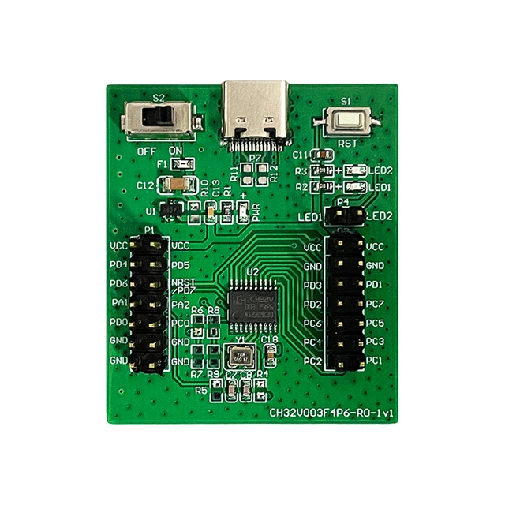

.. _wch_ch32v003evt:

WCH CH32V003EVT
###############

Overview
********

The `WCH`_ CH32V003EVT hardware provides support for QingKe 32-bit RISC-V2A
processor and the following devices:

* CLOCK
* FLASH
* :abbr:`GPIO (General Purpose Input Output)`
* :abbr:`NVIC (Nested Vectored Interrupt Controller)`
* :abbr:`PWM (Pulse Width Modulation)`

     WCH CH32V003EVT (Credit: WCH)

The board is equipped with two LEDs. The `WCH webpage on CH32V003`_ contains
the processor's information and the datasheet.

Hardware
********

The QingKe 32-bit RISC-V2A processor of the WCH CH32V003EVT is clocked by an
external crystal and runs at 48 MHz.

Supported Features
==================

The wch_ch32v003evt board configuration supports the following hardware
features:

+-----------+------------+----------------------+
| Interface | Controller | Driver/Component     |
+===========+============+======================+
| CLOCK     | on-chip    | clock_control        |
+-----------+------------+----------------------+
| FLASH     | on-chip    | flash                |
+-----------+------------+----------------------+
| GPIO      | on-chip    | gpio                 |
+-----------+------------+----------------------+
| PWM       | on-chip    | pwm                  |
+-----------+------------+----------------------+

Other hardware features have not been enabled yet for this board.

Connections and IOs
===================

LED
---

* LED = Unconnected. Connect to an I/O pin as needed.

Programming and Debugging
*************************

Applications for the ``wch_ch32v003evt`` board configuration can be
built and flashed in the usual way (see :ref:`build_an_application`
and :ref:`application_run` for more details); however, an external programmer
is required since the board does not have any on-board debug IC.

The following pins of the external programmer must be connected to the
following pins on the PCB (see image):

* VCC = VCC (do not power the board from the USB port at the same time)
* GND = GND
* SWIO = PD1

Flashing
========

You can use `minichlink` or `picorvd` to flash the board. Once `minichlink` or
`picorvd` have been set up, build and flash applications as usual (see
:ref:`build_an_application` and :ref:`application_run` for more details).

Here is an example for the :zephyr:code-sample:`blinky` application.

.. zephyr-app-commands::
   :zephyr-app: samples/basic/blinky
   :board: wch_ch32v003evt
   :goals: build flash

Debugging
=========

This board can be debugged via OpenOCD or `minichlink` or `picorvd`.

Testing the LED on the WCH CH32V003EVT
**************************************

There is 1 sample program that allow you to test that the LED on the board is
working properly with Zephyr:

.. code-block:: console

   samples/basic/blinky

You can build and flash the examples to make sure Zephyr is running
correctly on your board. The button and LED definitions can be found
in :zephyr_file:`boards/wch/ch32v003evt/wch_ch32v003evt.dts`.

References
**********

.. target-notes::

.. _WCH: http://www.wch-ic.com
.. _WCH webpage on CH32V003: https://www.wch-ic.com/products/CH32V003.html
